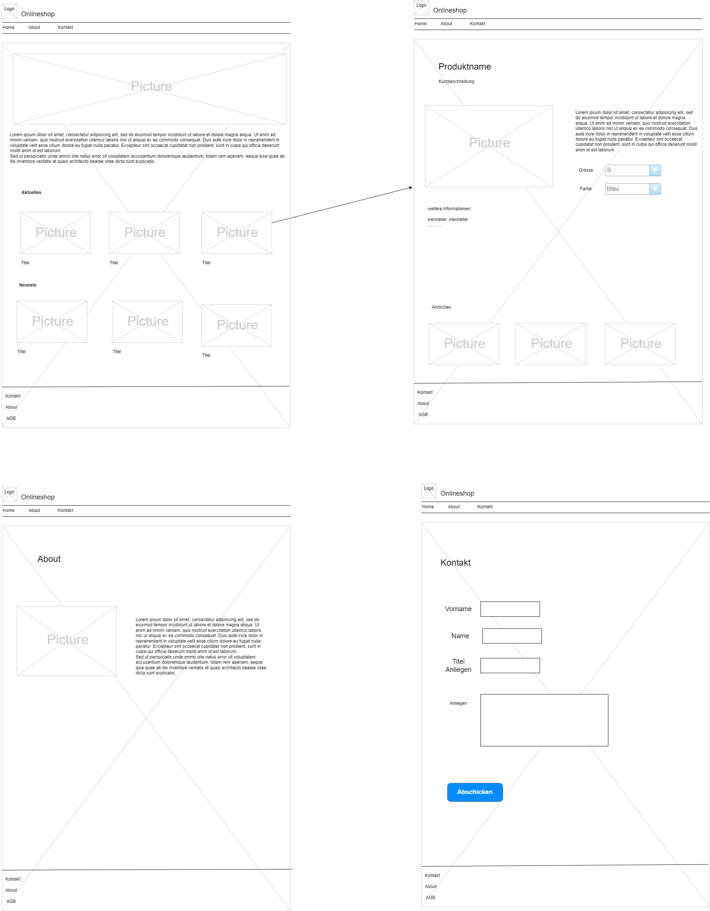

Dieses Projekt ist eine Webseite im Rahmen der TBZ im Modul 293.

Meine Webseite stellt ein Onlineshop dar. Das Projekt wird jedoch nur mit HTML und CSS erstellt. Es gibt eine Startseite, Seiten für die einzelnen Produkte und eine Formularseite und ein About Me.

